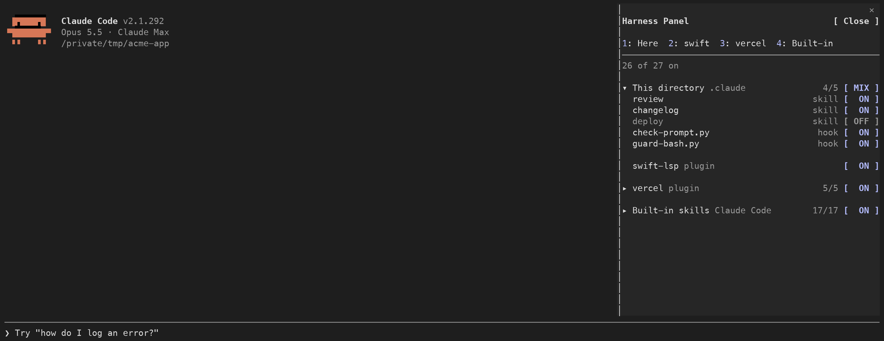
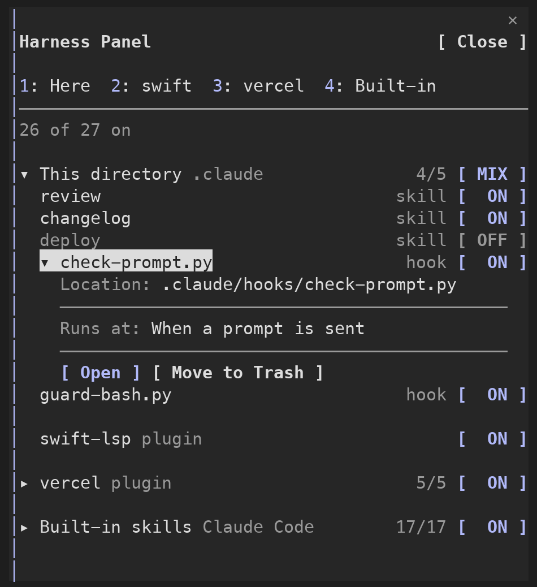

# Harness Panel

<p align="center">
  <a href="./README.md"></a>
  <a href="./README.ko.md"></a>
</p>

[Claude Code](https://code.claude.com) 옆에 패널을 띄워서, 지금 디렉토리에서 쓰는 스킬·훅·플러그인을 모두 보여주고 하나씩 켜고 끕니다.



## 목차

- [만든 이유](#만든-이유)
- [1. 설치](#1-설치)
- [2. 설치한 다음](#2-설치한-다음)
- [3. 패널에서 할 수 있는 것](#3-패널에서-할-수-있는-것)
- [4. 패널 자체를 끄고 켜기](#4-패널-자체를-끄고-켜기)
- [5. 끄는 방식](#5-끄는-방식)
- [6. 운영체제](#6-운영체제)
- [참고](#참고)

## 만든 이유

하네스는 Claude Code가 프로젝트의 코드 구조를 따르도록 제어하는 데 쓰입니다. 스킬로 작업 방법을 알려주고, 훅으로 규칙을 강제합니다. 그런데 최근 모델에서는 기존 하네스가 오히려 성능을 낮춘다는 생각이 들었습니다.

Harness Panel은 이를 테스트하기 위해 만든 도구입니다. 스킬과 훅을 하나씩 켜고 끌 수 있고, 같은 패널에서 파일을 열어 수정하거나 삭제할 수 있습니다. 하네스가 여전히 효과가 있는지 검증해야 하는 경우에 쓸 수 있습니다.

## 1. 설치

Claude Code 입력창에 입력합니다.

```
/plugin install harness-panel --marketplace selvr0/harness-panel
```

1. `Add marketplace?`가 나오면 `y`를 누릅니다.
2. 설치 범위를 고릅니다. 보통 `user`(내 모든 프로젝트)를 고릅니다.
3. `Installed harness-panel. Plugin is now active.`가 나오면 끝입니다.

## 2. 설치한 다음

패널을 한 번 엽니다.

```
/harness
```

다음 세션부터는 자동으로 열립니다.

**오른쪽에 붙여서 보려면** Claude Code의 전체 화면 모드가 필요합니다. 아니면 패널이 입력창 위에 뜹니다.

```
/tui fullscreen
```

**한국어로 보려면** `/config`에서 `harness-panel`의 `language`를 `ko`로 바꿉니다.

## 3. 패널에서 할 수 있는 것



| 하려는 것 | 방법 |
|---|---|
| 스킬·훅 하나 끄기·켜기 | 그 줄의 `[ ON ]` / `[ OFF ]` 버튼 |
| 섹션 전체 끄기·켜기 | 섹션 제목 옆 버튼 |
| 섹션으로 이동 | 맨 위 숫자 키, 또는 탭 클릭 |
| 파일 위치, 훅 실행 시점 보기 | 이름 클릭 |
| 에디터로 열기 | 이름 클릭 → `[ 열기 ]` |
| 휴지통으로 옮기기 | 이름 클릭 → `[ 휴지통으로 이동 ]` → `[ 옮기기 ]` |
| 되돌리기 | 맨 아래 `휴지통` 섹션 → `[ 되돌리기 ]` |
| 패널 닫기 | 오른쪽 위 `[ 닫기 ]` |
| 다시 열기 | `/harness` |

바꾼 것은 모두 **지금 디렉토리에만** 적용됩니다. 디렉토리마다 켜고 끈 상태가 따로 저장됩니다.

### 섹션

| 섹션 | 들어 있는 것 |
|---|---|
| 현재 디렉토리 | Claude Code를 연 디렉토리의 `.claude/` 안 스킬·훅 |
| 내 전역 | `~/.claude/` 안 스킬·훅 |
| claude.ai | claude.ai 계정에서 켜 둔 스킬 |
| 플러그인마다 하나 | 그 플러그인의 스킬·훅. 제목 옆 버튼은 플러그인 전체를 켜고 끔 |
| 기본 스킬 | Claude Code에 들어 있는 스킬 |

플러그인, claude.ai, Claude Code 기본 스킬은 끌 수는 있지만 휴지통으로 옮길 수는 없습니다.

## 4. 패널 자체를 끄고 켜기

패널도 플러그인이라서 Claude Code 플러그인 메뉴에서 끄고 켭니다.

| 하려는 것 | 입력 |
|---|---|
| 패널 끄기 | `/plugin disable harness-panel@harness-panel` |
| 다시 켜기 | `/plugin enable harness-panel@harness-panel` |
| 지우기 | `/plugin uninstall harness-panel@harness-panel` |

또는 `/plugin` → **Installed** → `harness-panel`을 고르고 Space를 누릅니다.

그다음 `/reload-plugins`를 치거나 새 세션을 엽니다.

**패널을 끄면, 패널에서 꺼 둔 것은 이렇게 됩니다.**

| 꺼 둔 것 | 패널을 끈 동안 |
|---|---|
| 내 스킬, 기본·claude.ai 스킬 | 계속 꺼져 있음. `.claude/settings.local.json`에 저장돼서 Claude Code가 직접 읽음 |
| 플러그인 전체 | 계속 꺼져 있음. 같은 파일 |
| 플러그인 스킬, 훅 | **다시 동작함.** 패널이 직접 막던 것이라서. 패널을 다시 켜면 다시 꺼짐 |

## 5. 끄는 방식

| 대상 | 저장 위치 | 적용 시점 |
|---|---|---|
| 내 스킬, 기본·claude.ai 스킬 | `.claude/settings.local.json`의 `skillOverrides`. `/skills`가 저장하는 곳과 같음 | 바로 |
| 플러그인 스킬 | 패널 저장소. 패널이 그 스킬 호출을 막음 | 바로 |
| 훅 | 패널 저장소. 꺼 둔 훅이 있으면 같은 이벤트의 나머지 훅을 패널이 대신 돌림 | 바로 |
| 플러그인 전체 | `.claude/settings.local.json`의 `enabledPlugins` | `/reload-plugins` 후 |

훅은 하나씩 꺼집니다. 어떤 이벤트에 꺼 둔 훅이 있으면, 그 이벤트의 나머지 훅은 Claude Code 대신 패널이 같은 방식으로 돌립니다. 이렇게 돌릴 수 있는 것은 `command` 훅뿐이라, 꺼 둔 훅이 있는 동안 그 이벤트의 다른 종류 훅은 돌지 않습니다.

## 6. 운영체제

| | macOS | Windows | Linux |
|---|---|---|---|
| 에디터로 열기 (순서대로 시도) | VS Code → Cursor → Zed → Sublime Text → 텍스트 편집기 | VS Code → Cursor → 메모장 | VS Code → Cursor → Zed → Sublime Text → `xdg-open` |
| 휴지통으로 옮기기 | Finder 휴지통 | 휴지통(Recycle Bin) | `gio trash` → `trash-put` → `~/.local/share/Trash` |

Windows와 Linux는 테스트로만 확인했고 실제 기기에서는 아직 써보지 않았습니다. 써보고 알려주시면 고치겠습니다.

## 참고

- Claude Code의 mod(함수 훅) 기능 위에서 동작합니다. 아직 시험판(Early access)이라 Claude Code가 업데이트되면 패널이 잠시 안 될 수 있습니다.
- Claude Code는 아직 `skillOverrides`로 플러그인 스킬 하나만 끌 수 없어서, 패널이 직접 막습니다.

## 개발

```
claude plugin validate .
claude plugin test .
```

## 라이선스

[MIT](./LICENSE)
